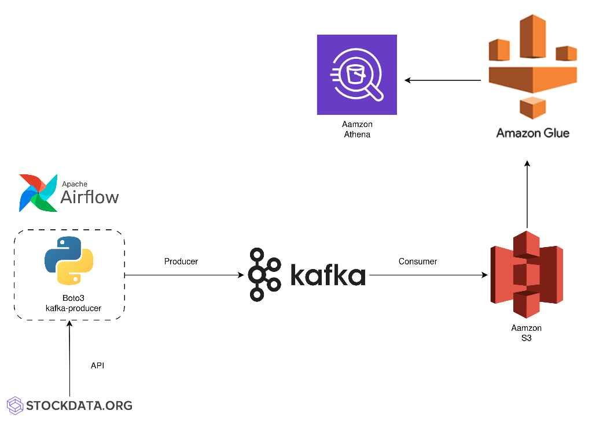

# Stock Market Kafka Real Time Data Pipeline Project

## Introduction 
A real-time data pipeline that streams stock market data from StockData.org to AWS for storage and analysis.
## Architecture 

## Technology Used
- Programming Language - Python
- Amazon Web Service (AWS):
  - S3 (Simple Storage Service)
  - Athena
  - Glue Crawler
  - Glue Catalog
  - EC2
- Apache Kafka
- Apache Airflow
## How to use
1. Make sure you installed Apache Airflow and related packages in requirements.txt
2. Put the airflow_producer.py file in dag folder
3. Adjust the code with your own api key and related amazon credentials
4. Run the code in consumer.ipynb
5. Check your Athena database, if you can preview the data then it worked :D
6. More detail instruction can be found at: https://youtu.be/KerNf0NANMo?list=PLBJe2dFI4sgvQTNNkI3ETYJgNPR4CBpFd
## Contribution 
If there are any question, please contact: 

Email: 22520600@gm.uit.edu.vn
